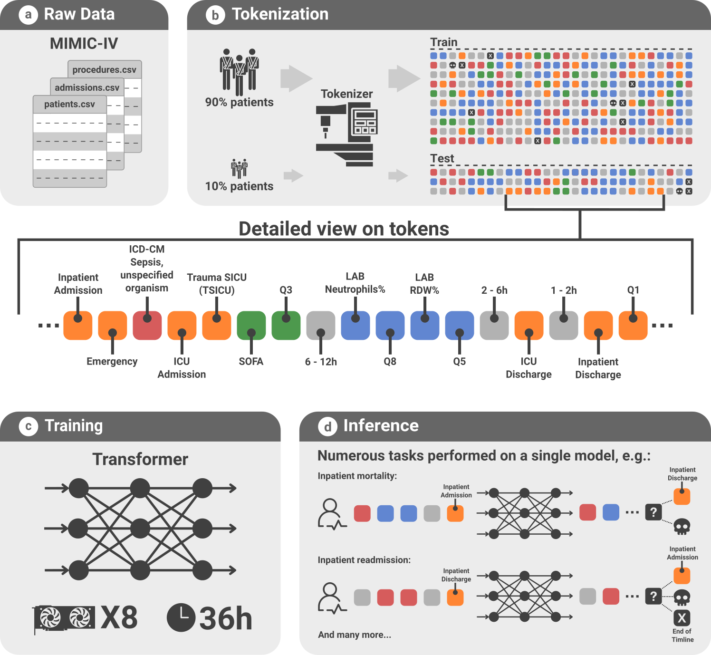

# ETHOS: Enhanced Transformer for Health Outcome Simulation

[ETHOS](https://www.nature.com/articles/s41746-024-01235-0) is a novel application of the
transformer deep-learning architecture, originally conceptualized for natural language processing.
This architecture, a cornerstone in large language model development, is repurposed in ETHOS to
analyze health-related data, moving beyond the textual focus of traditional LLMs. ETHOS is designed
to process Patient Health Timelines - detailed tokenized chronological records of health-related
events - to predict future health timelines.

<p align="center">
<a href="https://www.nature.com/articles/s41746-024-01235-0">
  
</a>
</p>

### Installation

Set up the development environment by following these steps:

#### Setting up the Environment

Python 3.10 or higher is required.

[Optional] We strongly encourage to use a virtual environment, for example Conda:
To create a new conda env:

```bash
conda create --name ethos python=3.10
conda activate ethos
```

Fetch the project and set it up in the development mode (`-e`) and install all necessary
dependencies for running notebooks and scripts by executing (`[all]` the all dependencies to run the
notebooks):

```bash
git clone https://github.com/ipolharvard/ethos-paper
cd ethos-paper
pip install -e .[all]
```

### Data Preparation

Prepare the dataset for analysis with these steps:

1. **Downloading the dataset:** Obtain the raw MIMIC-IV data
   from [PhysioNet](https://physionet.org/content/mimiciv/2.2/).
2. **Splitting the data:** Use the `scripts/data_train_test_split.py` script to divide the dataset
   into training and testing sets (this step requires 128GB RAM).
   <br>
   An example assuming the script is executed from the project root:
   ```bash
    python scripts/data_train_test_split.py ethos/data/mimic-iv-2.2
   ```
   The script generates a dataset folder with a `_Data` suffix. Ensure the processed data is
   named `mimic-iv-2.2_Data` or update the folder name in `ethos/tokenize/constants.py` accordingly.
   Use the `--help` option for more details.
3. **Organizing Dataset Directories:** Place the datasets in the project's data directory as
   follows:
   ```
   PROJECT_ROOT
   ├── pyproject.toml
   ├── README.md
   ├── scripts
   └── ethos
       └── data 
           ├── icd10cm-order-Jan-2021.csv.gz
               ...       
           ├── mimic-iv-2.2_Data_parquet <== optional (for faster loading `scripts/convert_csv_to_parquet.py`)
           ├── mimic-iv-2.2_Data         <== processed data (train/test split)
           └── mimic-iv-2.2              <== raw data from physionet.org
               ├── icu
               └── hosp
   ```

### Usage

We provide the following resources for reproducing the results from our paper (requires Google
Account):

- the pre-trained model with vocabulary
  at [Google Drive (≈0.5GB)](https://drive.google.com/file/d/1c8_OQadiHe0ZOoOdZuF-m0N3fbRnE1EP/view?usp=sharing)
- the results of inference
  at [Google Drive (≈0.8GB)](https://drive.google.com/file/d/1BgywarK7osx8xcyzZamOgSBhMJZqKlPy/view?usp=sharing)

Execute the project pipeline as follows:

1. **Dataset tokenization:** Assuming that the MIMIC dataset is prepared, convert the dataset from
   the tabular format to the tokenized format, starting with the training set, followed by the
   testing
   set using the training set's vocabulary. In case, you want to use the pre-trained model provided
   by us, you have to pass the vocabulary also when tokenizing the training dataset
   (`-j` option specifies the number of processes for the separator injection phase):
   ```bash
   ethos tokenize- mimic train -j 50
   ```
   Followed by:
   ```bash
   ethos tokenize- mimic test -v <path_to_vocab> -j 50
   ```
   Refer to `ethos tokenize- --help` and `scripts/run_tokenization.sh` for more details.
2. **Model training:** Train the model on the tokenized dataset. Monitor the training process with
   wandb (the wandb API key is needed). An example configuration for running on 8 GPUs
   (adjust `--nproc_per_node` and `--gradient_accumulation_steps` to match your setup):

   ```bash
   torchrun --no_python --standalone --nproc_per_node=8 ethos train \
     --data_train <data_path> \
     --val_frac 0.04 \
     --vocab <vocab-path> \
     --batch_size 32 \
     --block_size 2048 \
     --n_layer 6 \
     --n_head 12 \
     --n_embd 768 \
     --dropout 0.3 \
     --lr 0.0006 \
     --min_lr 0.00001 \
     --log_interval 5 \
     --eval_interval 1000 \
     --gradient_accumulation_steps 8 \
     --max_iters 1000000 \
     --lr_decay_iters 50000 \
     --eval_iters 50 \
     --ctx_no_grad \
     --out_dir "out/mimic_layer_6_batch_32_do_0.3"
   ```
   Refer to `ethos train --help` and `scripts/run_inference.sh` for more details.
3. **Model evaluation:** Use the trained model for predicting future health timelines based on
   scenarios found in ethos/datasets, like ICU readmission or hospital mortality.
   ```bash
   ethos infer \
     --test readmission \
     --data <data-path in ethos/data> \
     --vocab <vocab-path in ethos/data> \
     --model <model-path> \
     --out_dir <output-path>
   ```
   Refer to `ethos infer --help` and `scripts/run_inference.sh` for more details.
4. **Generating results:** Use the Jupyter notebooks to generate all the results and figures:
    - `notebooks/mimic_paper_results_agg.ipynb`
    - `notebooks/embedding_analysis.ipynb`

## Cite us

If you use ETHOS in your research, please cite our work:

Pawel Renc, Yugang Jia, Anthony E Samir, Jaroslaw Was, Quanzheng Li, David W Bates, Arkadiusz Sitek,
"Zero shot health trajectory prediction using transformer" npj Digital Medicine, 19 Sep 2024

BibTeX:

```
@article{renc_zero_2024,
	title = {Zero shot health trajectory prediction using transformer},
	volume = {7},
	copyright = {2024 The Author(s)},
	issn = {2398-6352},
	url = {https://www.nature.com/articles/s41746-024-01235-0},
	doi = {10.1038/s41746-024-01235-0},
	abstract = {Integrating modern machine learning and clinical decision-making has great promise for mitigating healthcare’s increasing cost and complexity. We introduce the Enhanced Transformer for Health Outcome Simulation (ETHOS), a novel application of the transformer deep-learning architecture for analyzing high-dimensional, heterogeneous, and episodic health data. ETHOS is trained using Patient Health Timelines (PHTs)—detailed, tokenized records of health events—to predict future health trajectories, leveraging a zero-shot learning approach. ETHOS represents a significant advancement in foundation model development for healthcare analytics, eliminating the need for labeled data and model fine-tuning. Its ability to simulate various treatment pathways and consider patient-specific factors positions ETHOS as a tool for care optimization and addressing biases in healthcare delivery. Future developments will expand ETHOS’ capabilities to incorporate a wider range of data types and data sources. Our work demonstrates a pathway toward accelerated AI development and deployment in healthcare.},
	language = {en},
	number = {1},
	urldate = {2024-09-24},
	journal = {npj Digital Medicine},
	author = {Renc, Pawel and Jia, Yugang and Samir, Anthony E. and Was, Jaroslaw and Li, Quanzheng and Bates, David W. and Sitek, Arkadiusz},
	month = sep,
	year = {2024},
	pages = {1--10},
}
```
